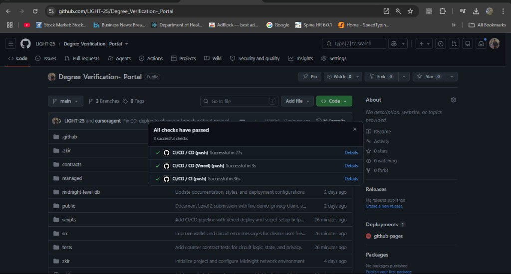
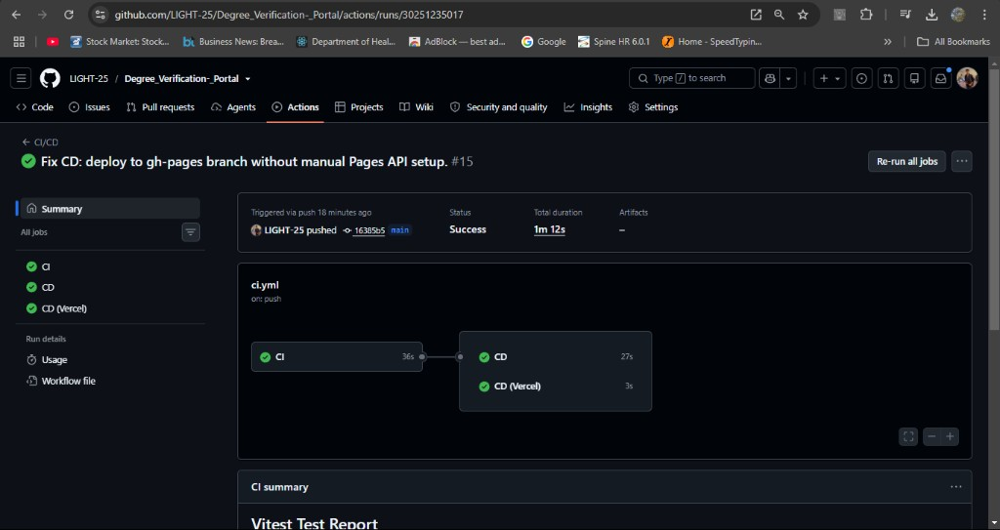

# Degree Verification Portal


This project is built on the Midnight Network.

> A privacy-preserving dApp on Midnight Network that proves degree credentials without revealing private data on-chain.

---

## Level 1 — Compact Contract on Preprod

Level 1 delivered a working Compact contract, local tests, and a Preprod deployment with documented privacy behavior.

### Contract Address

| Network    | Address |
|------------|---------|
| Undeployed | `3523aa3006329b8e763ba2cc655fb9a0e25833d2f11072c1d50146a830074d0b` |
| Preview    | Pending deployment |
| Preprod    | `a746a03e40e6e4b36ec451548e355f2611657c2334e0e7594c3d14d4ef8da1de` |

(Contract address is MANDATORY. Do not leave this blank.)

Verify Preprod on-chain:

- [preprod.midnightexplorer.com](https://preprod.midnightexplorer.com/)
- [midnight-preprod.subscan.io](https://midnight-preprod.subscan.io/)
- [explorer.1am.xyz (preprod)](https://explorer.1am.xyz/?network=preprod)

### Deployer Wallet (Preprod)

```text
mn_addr_preprod18hl0hkw2sjdwuwztatxzp2mhwpre2w4hc9tlyx0l457k8dxd0fsqrda6jm
```

Fund this address from the [Preprod faucet](https://midnight-tmnight-preprod.nethermind.dev/) when deploying or calling from the CLI.

### What This Does (Level 1)

This contract keeps a public counter on the ledger and accepts a private witness input that must be strictly positive before the counter can be incremented. The circuit intentionally discloses the increment value only as part of the state transition, while the private witness remains part of the proof context rather than being exposed as public data.

### Privacy Model

- **What is PUBLIC** (on-chain, visible to anyone): the counter value and the disclosed increment amount.
- **What is PRIVATE** (private witness, never shown as a public DApp input): the original private input supplied to the circuit.
- **What the user PROVES without revealing:** that the increment was positive and that the transition is valid.

### Privacy Claim

An on-chain observer can see that the counter was incremented and by how much (via `disclose()`). However, the private witness input — the value the user originally supplied to the circuit — is never displayed in the UI result surface. The user proves the increment is valid (positive, correct arithmetic) without revealing the raw private input as a public application field. The UI shows proof status and on-chain result only.

### Initial Idea

The **Degree Verification Platform** is a privacy-first smart contract built on the Midnight network. It allows universities to securely issue academic credentials while empowering students to prove their degree qualifications to employers without exposing sensitive, underlying private data on a public ledger. By using Midnight's zero-knowledge proofs, the platform ensures that the verification is cryptographically secure and tamper-proof.

### Level 1 Screenshots
##compilation screen shot:


##Deployment screenshot:


### Level 1 Tech Stack

- Midnight network
- Compact language
- Node.js v22
- Docker

### Level 1 Prerequisites

- Node.js v22+
- Docker Desktop or Docker Engine with Compose v2
- Midnight Compact compiler support via the VS Code extension or local toolchain

### Level 1 Setup

```bash
git clone https://github.com/LIGHT-25/Degree_Verification-_Portal.git
cd Degree_Verification-_Portal
npm install
docker compose up -d --wait
npm test
```

### Run Tests

```bash
npm test
```

---

## Level 2 — Frontend + Lace on Preprod

Level 2 builds on Level 1: the same Preprod contract is wired to a React frontend, Lace wallet connect/disconnect works on Preprod, and `incrementCounter` is called from the browser.

### Level 2 Submission Checklist

| Requirement | Status |
|-------------|--------|
| Public GitHub repository with README | ✅ This repo |
| Live demo (Vercel) | ✅ [degree-verification-portal-one.vercel.app](https://degree-verification-portal-one.vercel.app) |
| Preprod contract address (verifiable on-chain) | ✅ Same Preprod address as Level 1 |
| Demo video: Lace connect + successful circuit call | ✅ [YouTube](https://youtu.be/G2w07YhLLnc) |
| README documents the privacy claim | ✅ See Privacy Claim above |
| Minimum 8 meaningful commits | ✅ |
| Lace connect / disconnect | ✅ |
| Circuit called from frontend | ✅ |
| Observable privacy behavior | ✅ Private witness + ZK proof; UI does not display private input |

### Live Demo

**https://degree-verification-portal-one.vercel.app**

### Demo Video

Wallet connect / disconnect and a successful `incrementCounter` circuit call on Preprod:

**Watch on YouTube:** https://youtu.be/G2w07YhLLnc

Also in the repo: [circuit_calling_proof.mp4](./circuit_calling_proof.mp4)

### Try the Live Demo

1. Install the [Lace](https://chromewebstore.google.com/detail/lace/gafhhkghbfjjkeiendhlofajokpaflmk) browser extension.
2. Set Lace network to **Preprod**.
3. Set Lace proof server to `http://localhost:6300`.
4. From this repo run: `npm run proof-server:start` (Docker required).
5. Fund Lace with tNIGHT from the [Preprod faucet](https://midnight-tmnight-preprod.nethermind.dev/), then generate tDUST in Lace.
6. Open the live demo → **Connect** → call the circuit.

### What Level 2 Adds

- Lace wallet **connect / disconnect** via `@midnight-ntwrk/dapp-connector-api`
- Circuit call from the React UI (`incrementCounter`) with result handling
- Local private state management in the browser
- Frontend deployed to Vercel, still targeting the Level 1 Preprod contract

### Level 2 Tech Stack (additions)

- Midnight.js SDK (`midnight-js-contracts`, ZK config, indexer provider)
- `@midnight-ntwrk/dapp-connector-api` (Lace)
- React 19 + Vite
- Vercel (frontend hosting)

### Run the Frontend Locally

```bash
git clone https://github.com/LIGHT-25/Degree_Verification-_Portal.git
cd Degree_Verification-_Portal
npm install
npm run proof-server:start
npm run dev
```

Open the Vite URL. Lace must be on **Preprod** with proof server `http://localhost:6300`.

### Scripts

| Script | Purpose |
|--------|---------|
| `npm test` | Level 1 contract tests |
| `npm run deploy` | Deploy / interact via CLI |
| `npm run dev` | Local UI (Level 2) |
| `npm run build:ui` | Production UI build (Vercel) |
| `npm run proof-server:start` | Local Docker proof server on `:6300` |

---

## Level 3 — Tests, CI/CD & Polish

Level 3 adds a full test suite (circuit logic, state transitions, privacy), a GitHub Actions **CI/CD** pipeline, UI polish, and a product proposal template.

### Level 3 Submission Checklist

| Requirement | Status |
|-------------|--------|
| 3+ tests passing (circuit / state / privacy) | ✅ 6 tests in `tests/counter.test.ts` |
| CI/CD pipeline on push to `main` | ✅ [`.github/workflows/ci.yml`](./.github/workflows/ci.yml) |
| CI badge in README | ✅ Green badge at top of this file |
| Contract address in README | ✅ See Level 1 Contract Address table |
| Privacy Model section in README | ✅ See Level 1 Privacy Model |
| `PROPOSAL.md` created | ✅ [PROPOSAL.md](./PROPOSAL.md) |
| dApp builds with zero errors | ✅ `npm run build` |
| File structure matches spec | ✅ `contracts/`, `managed/`, `src/`, `tests/`, `.github/workflows/` |

### Live Demo

- **Vercel:** https://degree-verification-portal-one.vercel.app
- **GitHub Pages (CD):** https://light-25.github.io/Degree_Verification-_Portal/

### Demo Video

Full dApp flow, passing tests, and green CI/CD checks:

**Watch on YouTube:** https://youtu.be/fiG9rZI_F7k

### Level 3 Screenshots

**All checks passed (CI + CD):**



**CI/CD workflow run (CI → CD → CD Vercel):**



### What Level 3 Adds

- **Tests:** 6 Vitest tests covering circuit logic, ledger state transitions, and privacy (private witness never in public output)
- **CI:** compile → test → production build on every push and PR
- **CD:** auto-deploy to GitHub Pages (`gh-pages` branch) after CI passes on `main`
- **CD (Vercel):** optional deploy when `VERCEL_*` secrets are configured
- **UI polish:** error states, loading spinner during proof generation, privacy labels, mobile-responsive layout
- **PROPOSAL.md:** product proposal template for Level 3+

### Run Tests

```bash
npm test
```

### CI/CD

Workflow: [`.github/workflows/ci.yml`](./.github/workflows/ci.yml)

#### CI (Continuous Integration)

Runs on every **push to `main`** and every **pull request**:

1. Checkout code
2. Install Node.js v22
3. Install / update Compact toolchain
4. `npm install`
5. `compact compile` for `contracts/counter.compact`
6. Run test suite (`npm test`)
7. Production build check (`npm run build`)

#### CD (Continuous Deployment)

Runs on every **push to `main`**, after CI succeeds:

**CD (GitHub Pages)** — always runs:

1. Build production UI
2. Push `dist/` to the `gh-pages` branch
3. Live at https://light-25.github.io/Degree_Verification-_Portal/

**CD (Vercel)** — optional, when secrets are set:

| Secret | Where to get it |
|--------|-----------------|
| `VERCEL_TOKEN` | Vercel → Account Settings → Tokens |
| `VERCEL_ORG_ID` | `.vercel/project.json` after `vercel link` |
| `VERCEL_PROJECT_ID` | Same as above |

### Setup & Run Locally (Level 3)

```bash
git clone https://github.com/LIGHT-25/Degree_Verification-_Portal.git
cd Degree_Verification-_Portal
npm install
npm run compile
npm run proof-server:start
npm run proxy:start    # required for Vercel live demo (CORS proxy → :6300)
npm run dev
```

For the **Vercel live demo**, also run `npm run proxy:start` in a separate terminal (routes proof requests through `http://localhost:3333`).

### Level 3 Scripts

| Script | Purpose |
|--------|---------|
| `npm test` | Contract unit tests (circuit / state / privacy) |
| `npm run compile` | Compact compile + ensure root `managed/` |
| `npm run build` | Production UI build |
| `npm run proof-server:start` | Docker proof server on `:6300` |
| `npm run proxy:start` | CORS proxy on `:3333` (for live Vercel demo) |

### Product Proposal

See [PROPOSAL.md](./PROPOSAL.md)

---

## Repository

- GitHub: https://github.com/LIGHT-25/Degree_Verification-_Portal
- License: MIT
