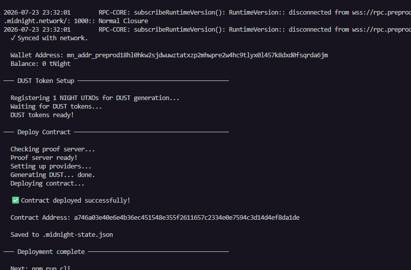

# Degree Verification Platform

> A Midnight compact contract that tracks a public counter while proving private increment values without exposing them on-chain.

## Contract Address

| Network    | Address |
|------------|---------|
| Undeployed | `3523aa3006329b8e763ba2cc655fb9a0e25833d2f11072c1d50146a830074d0b` |
| Preprod    | `a746a03e40e6e4b36ec451548e355f2611657c2334e0e7594c3d14d4ef8da1de` |

## What This Does

This contract keeps a public counter on the ledger and accepts a private witness input that must be strictly positive before the counter can be incremented. The circuit intentionally discloses the increment value only as part of the state transition, while the private witness remains part of the proof context rather than being exposed as public data.

## Privacy Model

- What is PUBLIC (on-chain, visible to anyone): the counter value and the disclosed increment amount.
- What is PRIVATE (private witness, never on-chain): the original private input supplied to the circuit.
- What the user PROVES without revealing: that the increment was positive and that the transition is valid.

## Tech Stack

- Midnight network
- Compact language
- Node.js v22
- Docker

## Prerequisites

- Node.js v22+
- Docker Desktop or Docker Engine with Compose v2
- Midnight Compact compiler support via the VS Code extension or local toolchain

## Setup

```bash
git clone <your-repo-url>
cd Degree_Verification_platform
npm install
docker compose up -d --wait
npm test
```

## Run Tests

```bash
npm test
```

## Initial Idea

The **Degree Verification Platform** is a privacy-first smart contract built on the Midnight network. It allows universities to securely issue academic credentials while empowering students to prove their degree qualifications to employers without exposing sensitive, underlying private data on a public ledger. By using Midnight's zero-knowledge proofs, the platform ensures that the verification is cryptographically secure and tamper-proof.

## Screenshots


